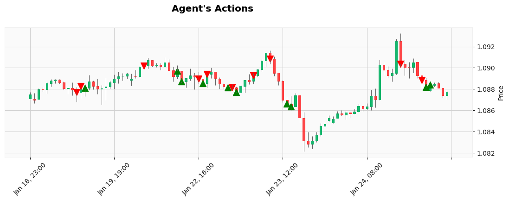

# Training PPO on stock market

A PPO is trained on a real data from stock market. 

  

The aim is to test this agent on a random data to test [Random Walk Hypothesis](https://en.wikipedia.org/wiki/Random_walk_hypothesis). 
For now, it is shown that it works significantly better than random agent on test data. 